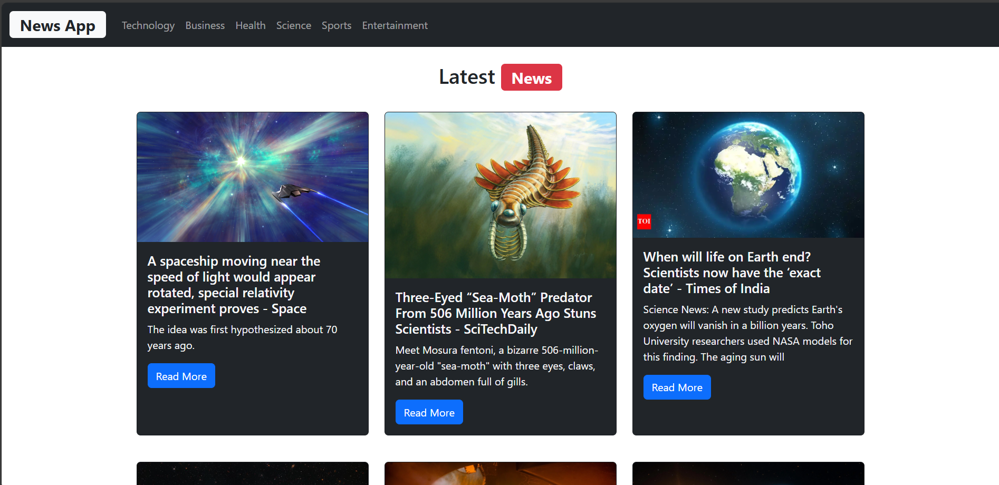

Here's a professional and complete `README.md` file for your **News App using React and NewsAPI**:

---

````markdown
# 📰 News App

A modern news application built with **React** that fetches the latest top headlines using the **NewsAPI**. It allows users to browse news by categories such as Technology, Business, Health, Sports, Entertainment, and more.

## 🌟 Features

- 🗞️ View top headlines from the U.S.
- 🧭 Filter news by category (Technology, Business, Health, etc.)
- 🖼️ Beautiful UI with Bootstrap 5
- 🔗 "Read More" button linking to the full article
- 🧠 Modular and reusable component structure

---

## 📸 Screenshots

## 

## 🧰 Tech Stack

- **React** (Vite)
- **Bootstrap 5**
- **NewsAPI** (https://newsapi.org)
- **JavaScript (ES6)**

---

## 🚀 Getting Started

### 1. Clone the repository

```bash
git clone https://github.com/your-username/news-app.git
cd news-app
```
````

### 2. Install dependencies

```bash
npm install
```

### 3. Setup API Key

- Create a `.env` file at the **root of the project** (not inside `src/`)
- Add your NewsAPI key in the `.env` file like this:

```env
VITE_API_KEY=your_actual_api_key_here
```

> 🔒 Replace `your_actual_api_key_here` with your key from [https://newsapi.org](https://newsapi.org)

### 4. Run the development server

```bash
npm run dev
```

Open [http://localhost:5173](http://localhost:5173) to view the app in your browser.

---

## 📁 Project Structure

```
src/
├── Components/
│   ├── Navbar.jsx
│   ├── NewsBoard.jsx
│   └── NewsItem.jsx
├── App.jsx
├── main.jsx
└── index.css
```

---

## 🔧 Available Scripts

- `npm run dev` – Starts the development server
- `npm run build` – Builds the app for production
- `npm run preview` – Previews the production build

---

## 📌 Note

- This app is for educational/demo purposes. NewsAPI's free tier has some limitations (e.g., number of requests per day).
- Ensure you are not committing your API key to public repositories.

---

## 🤝 Contributing

Contributions are welcome! Feel free to open issues or submit pull requests to improve the project.

- 🚀 Don't forget to start the project

---

## 🧑‍💻 Author

Built with 💻 by Yash Yadav
